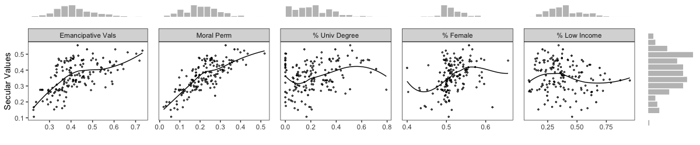
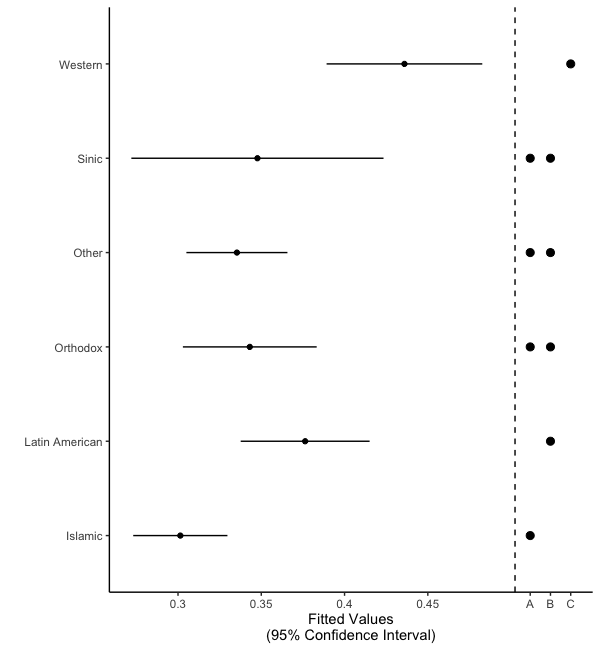

# psre

This R package supports </em>Presenting Statistical Results Effectively</em> (Sage, 2022) by Bob Andersen and Dave Armstrong.  The package contains the data and replication code that recreates all of the visualizations in the book.  

You can install the package directly from GitHub using the `remotes` package: 

```
remotes::install_github("davidaarmstrong/psre")
```

After installation, the replication code will be in the package directory under `replication_code` where there are two sub-directories: `figure_code` and `table_code`.  You can identify the location of any of these files with: 

```r
system.file("replication_code/figure_code", "fig1_2.r", package="psre")
```

Perhaps more easily, these files can be downloaded en masse from the book's [dataverse](https://dataverse.harvard.edu/dataverse/psre).  The package will be on CRAN, but development and bug fixes will appear more rapidly on GitHub than on CRAN. 

Most of the functions in the package are helper functions that permit the construction of plots that are made automatically in either base R or lattice as ggplots.  That is, they return the data required to make the plot rather than making the plot itself.  The following functions do that: 

- `normBand` uses the `sm.density()` function from the `sm` package to generate density estimates with variability bands and a corresponding normal density (with the same mean and variance as the original variable) also with variability bands. 
- `qqPoints` uses the guts of the `qqPlot()` function from the `car` package to produce the relevant information to make quantile comparison plots in the ggplot framework. 

There are a couple of functions that we feel make more interesting contributions.  In the book, we propose as an alternative to a full scatterplot matrix, a **linear scatterplot array**.  This is a series of scatterplots where the dependent variable from the model is always on the y-axis, but each panel has a different covariate on the x-axis.  There are also marginal histograms that show the distribution of each of the independent variables above the plots and the distribution of the dependent variable on the right-hand side of the array.  An example is below: 

```r
data(wvs)
library(dplyr)
tmp <- wvs %>% 
  select(resemaval, moral, pct_univ_degree, pct_female, 
         pct_low_income, sacsecval) %>% 
  filter(resemaval > 0.1 & sacsecval > 0.1 ) 
form <- reformulate(c("resemaval", "moral", "pct_univ_degree", 
                      "pct_female", "pct_low_income"), 
                      response="sacsecval")
lsa(formula = form, 
    xlabels = c("Emancipative Vals", "Moral Perm", 
                "% Univ Degree", "% Female", "% Low Income"), 
    ylab = "Secular Values", 
    data=tmp)
```



The other sort-of innovation is a plot that joins a compact letter display with a coefficient plot.  There is a similar plot in the `multcomp` package, but it plots box-plots rather than coefficient estimates.  Here is an example of the plot we produce.  

```r
wa1 <- wvs %>% 
  ungroup %>% 
  mutate(pct_sec_plus = pct_secondary + pct_some_univ + pct_univ_degree, 
           civ = case_when(
            civ == 4 ~ "Islamic", 
            civ == 6 ~ "Latin American", 
            civ == 7 ~ "Orthodox", 
            civ == 8 ~ "Sinic", 
            civ == 9 ~ "Western", 
            TRUE ~ "Other"), 
          civ = factor(civ, 
                       levels=c("Western", "Sinic", "Islamic", 
                                "Latin American", "Orthodox", "Other"))) %>% 
  group_by(country) %>% 
  slice(1) %>% 
  filter(country != "Poland")
mod <- lm(resemaval ~ I(gdp_cap/10000) + civ + pct_sec_plus, data=wa1)
gp <- ggeffects::ggpredict(mod, terms="civ", typical="mean")
pwc <- summary(multcomp::glht(mod, linfct=multcomp::mcp(civ = "Tukey")), 
               test=multcomp::adjusted(type="none"))
cld1 <- multcomp::cld(pwc)
lmat <- cld1$mcletters$LetterMatrix

letter_plot(gp, lmat) + 
  labs(x="Fitted Values\n(95% Confidence Interval)")
```




In the above plot, we can see that the Islamic and Latin American civilizations are different from each other, the Western civilization is different from all others and there are no other significant pairwise differences among categories. 


